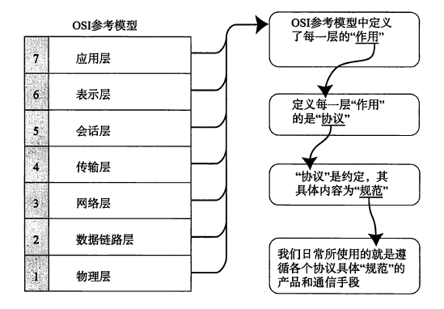
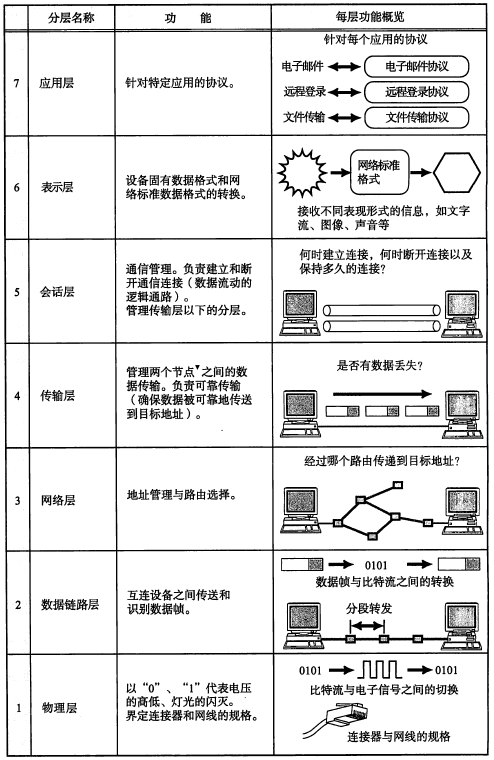
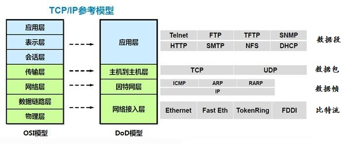
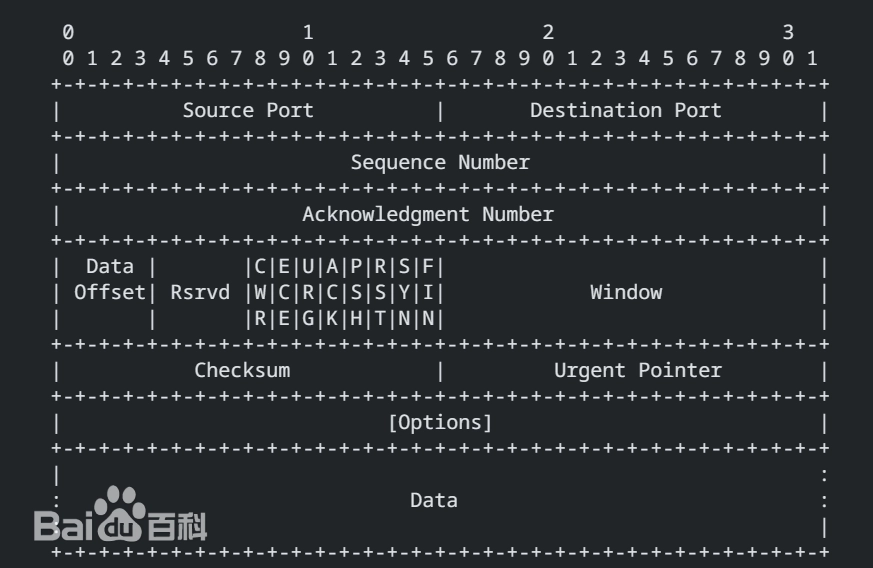
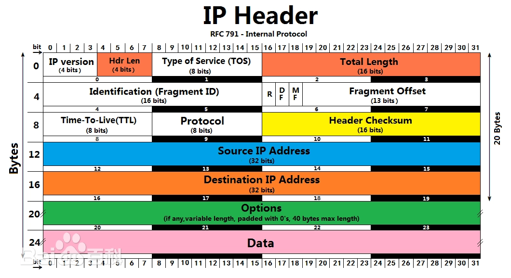

# 网络和网络协议
以无形之波，令万物互联
## 前言
网络这一概念，实在是宽泛又宽泛。它与人们的生活息息相关，更是现代社会不可或缺的一部分，可以说，这是一个相当伟大的概念。故而，在我们的讲述中，定然会漏掉很多东西，因为网络相关的内容实在是太多太复杂，我们无法做到用几篇短文将其讲述的面面俱到，还请诸位在遇到我们没有讲到的内容或者没有细讲的内容时，认真学习并查阅资料；对于感兴趣的同学，也请一定要去阅读相关权威书籍，这样才能避免浮于表面。
## 一、网络简介
网络是什么，相信大家并不陌生，在义务教科书中，我们也曾学过相关内容。在此先给出在汉语词典中网络的定义：
>在电的系统中，由若干元件组成的用来使电信号按一定要求传输的电路或这种电路的部分，叫网络。

可以看出，网络这个词包含的范围非常之广，我们听说过的局域网（local area network ，LAN），广域网（wide area network, WAN ）就属于网络的范畴。网络具有以下四大要素：
- 通信线路和通信设备
- 有独立功能的计算机
- 网络软件支持
- 实现数据通信与资源共享

每一个要素都不可或缺，它们一同组成了一个完整的网络，而正是因为有了网络，我们才能共享来自全世界的信息，实现万物互通、万物互联
## 二、网络协议
网络协议，顾名思义，就是与在网络上交互相关的协议，其定义如下：
> 网络协议为计算机网络中进行数据交换而建立的规则、标准或约定的集合。

正所谓“无规矩，不成方圆”，我们在使用网络进行数据交换的时候，也需要制定相关的规矩，也就是所谓的“网络协议（Network Protocol）”只有规定好了如何收发消息，才能避免自说自话这种无意义的情况发生

网络协议一般包含以下部分（来自百度百科）：
- 语义。语义是解释控制信息每个部分的意义。它规定了需要发出何种控制信息，以及完成的动作与做出什么样的响应。
- 语法。语法是用户数据与控制信息的结构与格式，以及数据出现的顺序。
- 时序。时序是对事件发生顺序的详细说明。（也可称为“同步”）。

其实简单地说，就是规定了大家该怎么“发消息”，怎么“收消息”，保证了收发消息的稳定性和可靠性

正如上文所说，网络这个东西实在是复杂又复杂，再加上不同厂商一开始都“各做各的”，对使用网络的人造成了很大的障碍，所以才有网络协议这一概念。为了统一标准，人们决定将网络功能分为七层，即开放系统互联（Open System Interconnection，OSI）模型。这七层分别是：
- 物理层（Physical Layer）
- 数据链路层（Data Link Layer）
- 网络层（Network Layer）
- 传输层（Transport Layer）
- 会话层（Session Layer）
- 表示层（Presentation Layer）
- 应用层（Application Layer）

具体如下图：

值得注意的是，分层与网络协议具有一定的对应关系，每一层都有相关的协议或标准，如此一来，不仅可以更好地制定业界统一的标准，每一个分层还可以独立使用（有没有想起我们之前学过的“类”和“函数”），即使一个有变化另外的也不会受到影响，这是一个创举

那么接下来，我们来简单介绍一个很常见的网路协议：TCP/IP协议
## 三、TCP/IP协议
在百度百科中给出其介绍如下：
>TCP/IP（Transmission Control Protocol/Internet Protocol，传输控制协议/网际协议）是指能够在多个不同网络间实现信息传输的协议簇。TCP/IP协议不仅仅指的是TCP 和IP两个协议，而是指一个由FTP、SMTP、TCP、UDP、IP等协议构成的协议簇， 只是因为在TCP/IP协议中TCP协议和IP协议最具代表性，所以被称为TCP/IP协议。

具体如下图所示：

简单来说，它其实是由很多协议构成的，其中IP协议属于网络层协议，而TCP则属于传输层协议。另外它还包含了数据链路层的协议和应用层的协议，可以说是在网络使用中最基本的协议了。它最早由科学家温顿·瑟夫(Vinton G. Cerf)博士和罗伯特・卡恩（Robert Elliot Kahn）博士设计出，两人因此也获得了美国国家技术奖章和图灵奖，并且和蒂姆·伯纳斯·李（Tim Berners-Lee）爵士等并称为“互联网之父”，可见该协议的影响之深远

### 参考内容

TCP协议的首部如下图：

IP协议的首部如下图：

具体的内容可以参考：
https://www.cnblogs.com/miangao/p/17838748.html

有关三次握手、UDP协议与更详细的TCP/IP协议内容都可以参阅该文

想要系统学习的同学一定要了解三次握手的相关内容，本文由于篇幅原因故而不进行详细讲述了，该部分留给有时间的同学着重学习

