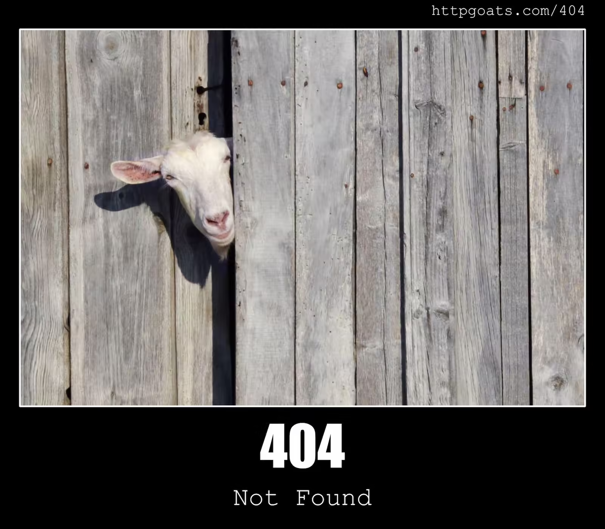

# HTTP状态码介绍

物有本末，事有终始

## 基本介绍

HTTP状态码（HTTP Status Code）是服务器在响应客户端请求时返回的三位数字代码，用于表示请求的处理结果。它们属于HTTP协议的一部分，帮助客户端（如浏览器）了解请求是否成功、是否需要进一步操作或出现了什么错误。状态码分为五个类别，以第一个数字区分：

- **1xx（信息性状态码）**：请求已接收，继续处理。
- **2xx（成功状态码）**：请求已成功被服务器接收、理解并处理。
- **3xx（重定向状态码）**：需要客户端进一步操作以完成请求。
- **4xx（客户端错误状态码）**：客户端请求有错误，服务器无法处理。
- **5xx（服务器错误状态码）**：服务器处理请求时发生错误。

在Web开发、API设计和日常浏览中，理解这些状态码有助于快速诊断问题并优化用户体验。下面列出一些常用的HTTP状态码及其解释。

## 常用HTTP状态码及解释

| 状态码 | 类别 | 描述 |
|--------|------|------|
| 200 | 2xx（成功） | **OK**：请求成功，服务器返回了请求的数据。常见于GET或POST请求成功时。 |
| 301 | 3xx（重定向） | **Moved Permanently**：资源已永久移动到新URL。客户端应更新书签或链接。 |
| 302 | 3xx（重定向） | **Found**（临时重定向）：资源临时移动到另一个URL，客户端应继续使用原URL。 |
| 400 | 4xx（客户端错误） | **Bad Request**：客户端请求有语法错误，服务器无法理解。例如，参数格式错误。 |
| 401 | 4xx（客户端错误） | **Unauthorized**：请求需要身份验证。客户端需提供有效的认证信息（如用户名和密码）。 |
| 403 | 4xx（客户端错误） | **Forbidden**：服务器理解请求，但拒绝执行。通常由于权限不足。 |
| 404 | 4xx（客户端错误） | **Not Found**：服务器未找到请求的资源。常见于URL错误或资源已被删除。 |
| 500 | 5xx（服务器错误） | **Internal Server Error**：服务器内部错误，无法完成请求。通常由于服务器端代码问题。 |
| 503 | 5xx（服务器错误） | **Service Unavailable**：服务器暂时无法处理请求，可能由于过载或维护。客户端可稍后重试。 |

例如，`404`代码表示找不到文件。

## 总结

HTTP状态码是Web通信的基础，它们简洁地传达了请求的结果。在编写应用程序或调试问题时，熟悉这些代码可以提高效率。